# 🕵️‍♂️ The Case of the Missing Sandwich

A flavorful command-line mystery where sandwiches are the suspects, and you're the detective.

This interactive deli-ordering simulation wraps engaging narrative, witty detective themes, and smooth console animations into a unique shopping experience — all in Java.

---

## 🍞 Project Overview

**"The Case of the Missing Sandwich"** is a terminal-based role-playing application that turns building a sandwich into an investigation.

You play the part of a hungry detective on the trail of the perfect sandwich. Explore signature suspects like the Philly Cheese Steak or BLT, or build your own with custom toppings, sides, and drinks. The app integrates animations, humor, and receipt generation for a complete deli noir experience.

---

## 📐 Architecture

Below is the class diagram that illustrates the structure of the application and relationships between core classes:

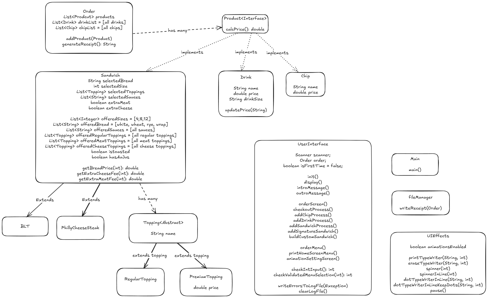

---

## 🧠 Features

- 🥪 **Build Your Own Sandwich**: Choose bread, size, toppings, sauces, and sides
- 🌟 **Signature Sandwiches**: Prebuilt classics like the BLT or Philly Cheese Steak
- 🧃 **Add Drinks**: Select drink size and flavor
- 🍟 **Add Chips**: Choose from a variety of crunchy sides
- 🧾 **Receipt Generation**: Save your order as a digital "case file"
- 🎭 **Narrative Dialogue**: Investigative-themed flavor text for every step
- 🎛️ **Toggle Animations**: Enable/disable console animations
- 📝 **Error Logging**: All exceptions are recorded to `exceptions.log`

---

## 📸 Demo

### 🟢 App Launch
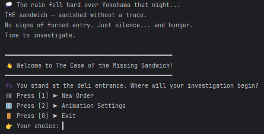

---

### 🥪 Building a Sandwich
Main Sandwich Menu:

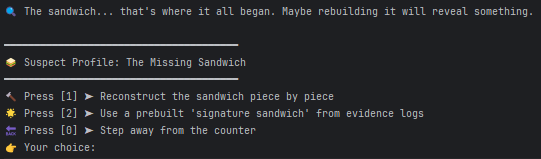

User selects ingredients interactively:

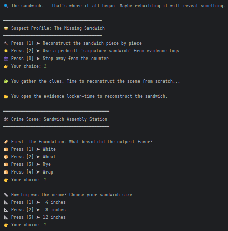

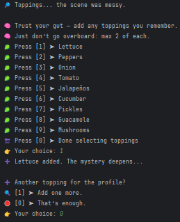

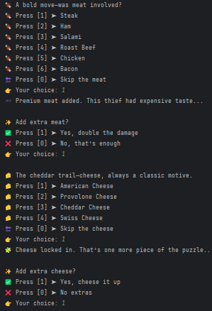

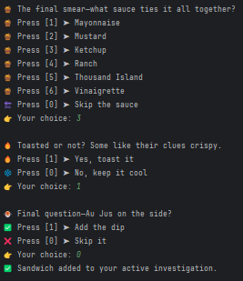

Prefilled Sandwich interactive:


---

### 🥤 Add a Drink

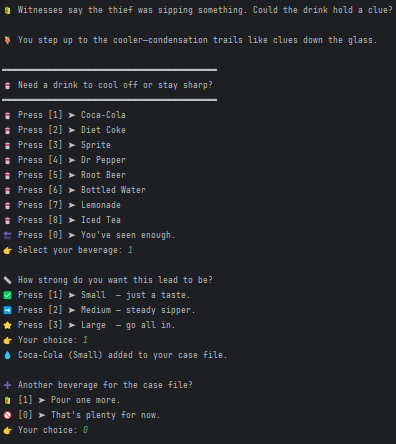

---

### 🍟 Add a Chip

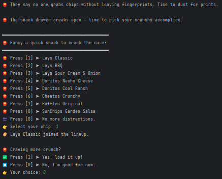


---

### 🧾 Final Receipt
A receipt showing the full order, pricing, and ingredient breakdown:

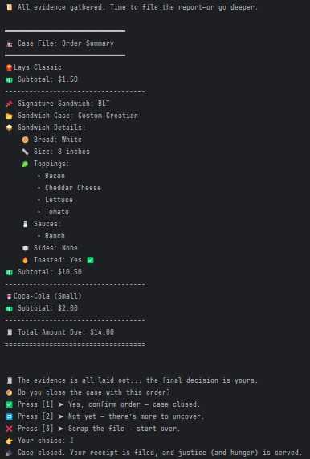

---

### ❌ Error Handling
Invalid input prompts a clear message:

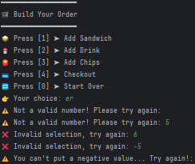

---

## 🔥 Cool Code Highlight: Validated Menu Selection

This method validates user input by ensuring the number is within range, 
repeatedly prompting until a valid choice is made for better usability and stability.


```java
//validate selection within menu range
    private static int checkValidatedMenuSelection(int maxOption) {
        int selection;

        do {
           selection = checkIntInput();
           if(selection < 0 || selection > maxOption) {
               System.out.print("❌ Invalid selection, try again: ");
           }
        } while(selection < 0 || selection > maxOption);

        return selection;
    }
```

---

## ⚠️ Disclaimer

This project was developed for educational purposes as part of a coursework assignment. It is not intended for production use. Features and functionality may be limited, and the codebase may lack the optimizations or testing standards required for real-world deployment.

Use at your own risk.

---

## 🧑‍💻 Author
💻 Developed by: Meixin Zhang

📅 Date: May 30th, 2025

Created with ❤️ using Java.